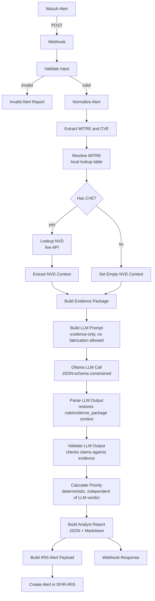

# Architecture

## Pipeline overview

## Design principles

**Evidence-grounded, not model-trusted.** The LLM only ever sees data placed
into the prompt by deterministic code (`Build Evidence Package`,
`Build LLM Prompt`) — it never queries NVD/MITRE itself. Everything it cites
is checked against that same evidence afterward in `Validate LLM Output`.

**Verdict and priority are decoupled.** `Calculate Priority` is a pure
deterministic function of `rule.level`, verified MITRE presence, and CVSS
score — it does not trust the LLM's self-reported `verdict` or `confidence`
as its sole input. This means a confidently-wrong model output still produces
a defensible priority score.

**Structural validity is enforced at the model boundary, not hoped for.**
`Ollama LLM Call` uses Ollama's JSON Schema `format` parameter
(`additionalProperties: false`, required keys, enums for `verdict`/`severity`)
so the model is structurally unable to emit a response shaped like its
fine-tuning data (e.g. CVE/CWE/CVSS classification output) instead of the
required triage schema.

**Validation catches content, not just shape.** Schema enforcement
guarantees shape; it does not guarantee truth. `Validate LLM Output` checks
whether MITRE/CVE IDs the model cites actually appear in the evidence it was
given, flags verdicts issued without supporting evidence, and marks the
result `is_usable: false` on schema-breaking failures.

## Key nodes

| Node | Role |
|---|---|
| `Normalize Alert` | Flattens inconsistent Wazuh alert shapes into one schema |
| `Extract MITRE and CVE` | Regex-extracts any MITRE technique IDs / CVE IDs present in the raw alert |
| `Resolve MITRE` | Looks up extracted MITRE IDs against a local verified table — splits into `mitre_resolved` / `mitre_unresolved` so unverified IDs are never silently trusted |
| `Lookup NVD` | Live query to NVD's public CVE API for verified CVSS/description when a CVE is present |
| `Build Evidence Package` | Assembles the one source of truth the LLM is allowed to reason from |
| `Build LLM Prompt` | Renders evidence into a prompt that explicitly separates "verified" from "unverified" context |
| `Ollama LLM Call` | Local LLM call via Ollama, JSON-schema constrained, low temperature (0.2) for determinism |
| `Parse LLM Output` | Parses model JSON; restores alert/evidence context lost when the HTTP Request node replaces `$json` with the raw API response |
| `Validate LLM Output` | Cross-checks model claims (`mitre_ids`, `cve_ids`, verdict/confidence consistency) against actual evidence |
| `Calculate Priority` | Deterministic P1–P4 scoring from rule level, verified MITRE, CVSS, verdict |
| `Build Analyst Report` | Produces the final 15-section structured report (JSON + Markdown) |
| `Build IRIS Alert Payload` / `Create Alert in DFIR-IRIS` | Raises a corresponding, filterable alert in DFIR-IRIS, tagged with verdict/priority |

## Known limitations (V1)

- The LLM (a 2B CVE/CWE-fine-tuned model) has shown repeated hallucination
  under test — including fabricating a non-existent CVE ID and labeling a
  verified CVSS 10.0 RCE as `FALSE_POSITIVE` at 0% confidence with no
  supporting evidence. The validation layer is designed to catch this, but
  `is_usable` does not yet hard-fail on "verdict with zero supporting
  evidence" — currently a soft flag only.
- No CVE/NVD response caching — repeat CVEs across alerts re-query NVD.
- No retry/error-branch handling on the two external HTTP calls (`Lookup NVD`,
  `Ollama LLM Call`) — a timeout on either currently fails the execution
  rather than producing a recorded, degraded-but-usable result.
- Webhook response mode (`lastNode`) means the caller's HTTP connection stays
  open for the full LLM call duration (observed: 11–20s) — worth considering
  for any caller with a short timeout.
- The LLM has also been observed reproducing the system prompt's worked-example
  phrasing nearly verbatim when an alert superficially resembles the example
  (same alert type, different actual file/host/timestamp) — suggesting pattern-
  matching to the example rather than independent reasoning over the evidence
  given. This is harder to detect than outright hallucination since the output
  looks clean and schema-valid.